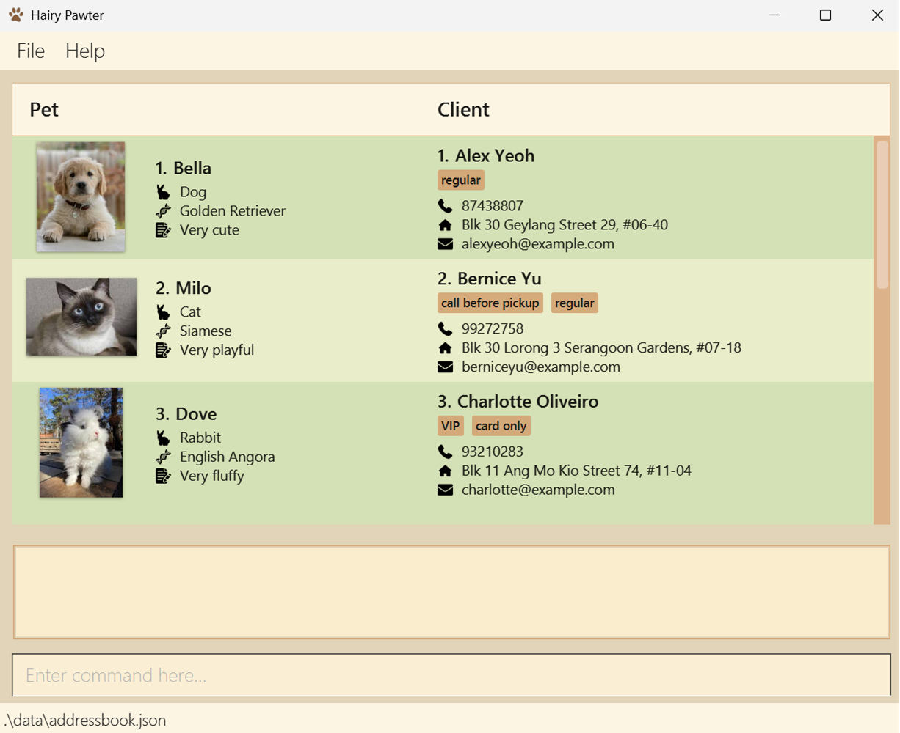

# Hairy Pawter

**Hairy Pawter is a desktop app for pet groomers to manage client contacts and pet records quickly using command-based interaction.**

Hairy Pawter is built for groomers who need fast access to client details, pet information, and appointment-related records without relying on heavy or complex software.

## Who is it for?

Hairy Pawter is for pet groomers who:
- handle multiple clients and pets
- need a fast and organized way to manage records
- prefer typing commands over navigating many buttons
- want a lightweight desktop solution

## What can it do?

- Add and manage customer records
- Store important pet-related information
- Edit and delete entries
- Search for records quickly
- Save data locally between sessions

## Documentation

- See the [User Guide](UserGuide.html) for usage instructions.
- See the [Developer Guide](DeveloperGuide.html) for implementation details.

## Acknowledgement

* This project is based on the AddressBook-Level3 project created by the [SE-EDU initiative](https://se-education.org).
* Libraries used: [JavaFX](https://openjfx.io/), [Jackson](https://github.com/FasterXML/jackson), [JUnit5](https://github.com/junit-team/junit5)
* Images used: [Dog](https://unsplash.com/photos/golden-retriever-puppy-on-focus-photo-9LkqymZFLrE) (Bill Stephan), [Cat](https://mypetandi.elanco.com/au/new-owners/so-you-re-thinking-about-getting-siamese-cat) (my pet & i), [Rabbit](https://www.jigidi.com/jigsaw-puzzle/86yg3txk/english-angora-rabbit/) (Jigidi)
* Icons used: [Footprint](https://www.flaticon.com/free-icons/footprint) (Daniel ceha), [Bunny](https://www.flaticon.com/free-icons/bunny) (Freepik), [Genes](https://www.flaticon.com/free-icons/genes) (Icon home), [Notepad](https://www.flaticon.com/free-icons/notepad) (Freepik), [Phone call](https://www.flaticon.com/free-icons/phone-call) (Ilham Fitrotul Hayat), [Home address](https://www.flaticon.com/free-icons/home-address) (KP Arts), [Email](https://www.flaticon.com/free-icons/email) (Freepik)
